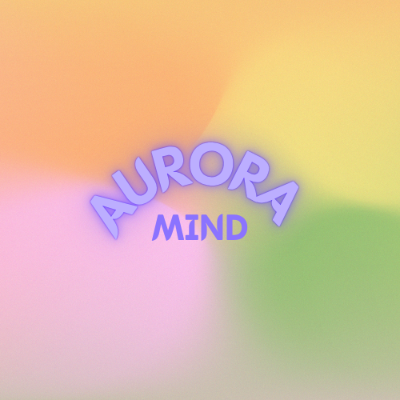

  

# 🌈 AuroraMind – Text-to-Aura Analyzer

Discover your emotional color through AI.  
AuroraMind uses an open-source emotion classification model to transform your text into an aura color.

## 🧠 Tech Stack
- Backend: FastAPI + Transformers
- Frontend: React + TailwindCSS + Axios
- Model: `j-hartmann/emotion-english-distilroberta-base`

## 🚀 Setup
1. `git clone https://github.com/<username>/AuroraMind.git`
2. `cd backend && pip install -r requirements.txt && uvicorn main:app --reload`
3. `cd frontend && npm install && npm run dev`
4. Open browser at http://localhost:5173
